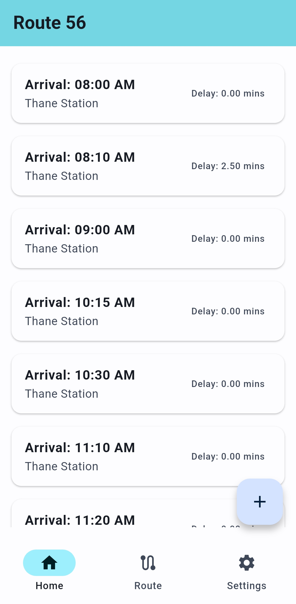

# Next Bus 🚍

> **A commuter-built transit app designed for reliability in low-network environments.**

Next Bus is a dynamic mobile application built with Flutter that solves the problem of unreliable bus schedules. Originally built for personal use on Routes 56 & 156 (Thane), it has evolved into a full-featured platform that allows commuters to view schedules, report real-time arrivals, and access data completely offline.

[](https://github.com/Sourish-Kanna/Next-Bus-Frontend/actions)
[](https://github.com/Sourish-Kanna/Next-Bus-Frontend/releases)


## 📱 Download

[](https://github.com/Sourish-Kanna/Next-Bus-Frontend/releases/latest)

---

## ✨ Features

### 👤 For Commuters

* **View Timings:** Access daily bus schedules for supported routes.
* **Offline Access:** The app works seamlessly without internet. View cached timetables and save reports locally.
* **Crowdsourced Reporting:** Easily report a bus arrival with a two-tap interface.
* **Dynamic Theming:** Beautiful Material Design 3 UI that adapts to your device's Light/Dark mode.

### 🛡️ For Admins

* **Route Management:** Add, edit, or remove bus routes directly from the app.
* **Timing Control:** Add specific timing entries for new buses.
* **Dashboard:** View all active routes and data health at a glance.

---

## 🛠️ Engineering Highlights

Beyond standard features, Next Bus solves complex real-world connectivity problems:

### 1. Offline-First Sync Engine

Commutes often happen in network dead zones.

* **Smart Queuing:** If a user reports a bus while offline, the data is serialized and stored locally.
* **Auto-Sync:** The app listens for connectivity changes and automatically flushes the queue when the internet returns.
* **Conflict Resolution:** Implements "Smart Deduplication." If a user sends a correction update within 2 minutes of a previous report, the app merges them locally to prevent server spam.

### 2. Robust State Management

* Built using **Provider** for efficient state handling.
* Separates UI logic from Data logic, ensuring the app remains responsive even during heavy background sync operations.

---

## 📸 Screenshots

| Home Screen | Offline Sync | Dark Mode | Admin Panel |
| :---: | :---: | :---: | :---: |
|  |  |  |  |

---

## ⚙️ Tech Stack

* **Framework:** Flutter (Dart)
* **Backend:** FastAPI (Python)
* **Database:** Firebase Firestore
* **CI/CD:** GitHub Actions (Auto-builds and signs APKs)

---

## 🚀 Getting Started

1. **Clone the repo**

    ```bash
    git clone [https://github.com/Sourish-Kanna/Next-Bus-Frontend.git](https://github.com/Sourish-Kanna/Next-Bus-Frontend.git)
    cd Next-Bus-Frontend
    ```

3. **Install Dependencies**

    ```bash
    flutter pub get
    ```

4. **Run**

    ```bash
    flutter run
    ```

## 🤝 Contributing

Contributions are welcome!

1. Fork the Project
2. Create your Feature Branch (`git checkout -b feature/AmazingFeature`)
3. Open a Pull Request

## 📄 License

Distributed under the MIT License. See `LICENSE` for more information.

## 📬 Connect

[Sourish Kanna](https://sourish-kanna.vercel.app) - [LinkedIn/sourish-kanna](https://www.linkedin.com/in/sourish-kanna) - [Project Link](https://github.com/Sourish-Kanna/Next-Bus-Frontend)
